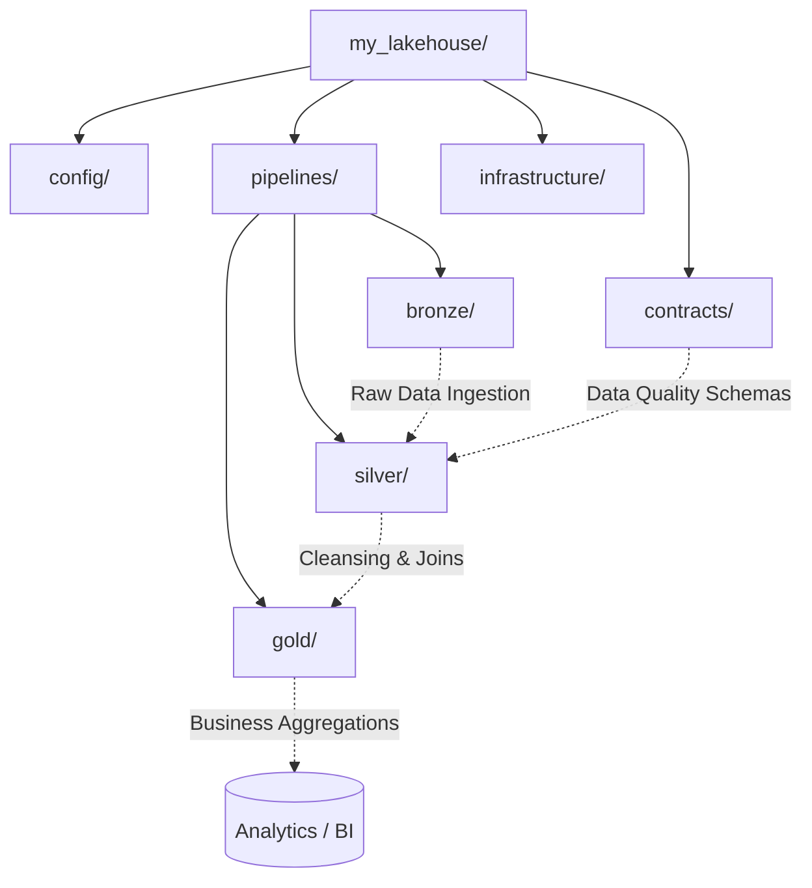

# QuickELT

```text
 ██████╗ ██╗   ██╗██╗ ██████╗██╗  ██╗███████╗██╗  ████████╗
██╔═══██╗██║   ██║██║██╔════╝██║ ██╔╝██╔════╝██║  ╚══██╔══╝
██║   ██║██║   ██║██║██║     █████╔╝ █████╗  ██║     ██║   
██║▄▄ ██║██║   ██║██║██║     ██╔═██╗ ██╔══╝  ██║     ██║   
╚██████╔╝╚██████╔╝██║╚██████╗██║  ██╗███████╗███████╗██║   
 ╚══▀▀═╝  ╚═════╝ ╚═╝ ╚═════╝╚═╝  ╚═╝╚══════╝╚══════╝╚═╝   
```


**QuickELT** is a modern, fast CLI tool to scaffold production-ready Lakehouse projects in seconds. It provides data ingestion templates, standardizes the Medallion Architecture, and automates infrastructure setup.

---

## 🚀 Quick Start

You can run `quickelt` without installing it permanently using `uvx`!

```bash
uvx --from quickelt quickelt init my_lakehouse
```

Alternatively, install it globally via `uv`:

```bash
uv tool install quickelt
quickelt init my_lakehouse
```

## 🛠️ Usage

### Interactive Mode (Wizard)

By simply running `quickelt init`, you'll be greeted with an interactive wizard that guides you through the project setup:

```bash
quickelt init
```

### Non-Interactive Mode

For CI/CD environments or power users, you can bypass the wizard by providing flags. Use the `--yes` (`-y`) flag to automatically accept default values for any omitted configurations.

```bash
quickelt init my_project --engine polars --storage adls --quality gx --iac terraform --yes
```

## 💻 Commands

| Command | Description |
|---|---|
| `quickelt init [project_name]` | Initializes a new Lakehouse project. Supports interactive wizard or CLI flags. |
| `quickelt doctor` | Verifies if your system has all required dependencies (Python, uv, Docker, Git, Terraform). |

**Available Flags for `init`:**
- `--storage` / `-s`: Cloud / Storage Target (`s3`, `adls`, `gcs`, `minio`)
- `--engine` / `-e`: Execution Engine (`polars`, `duckdb`)
- `--quality` / `-q`: Data Quality (`pandera`, `gx`, `none`)
- `--iac` / `-i`: Infrastructure (`terraform`, `none`)
- `--yes` / `-y`: Skip confirmations and use defaults when something is omitted.

## 🏗️ Project Structure (Medallion Architecture)

The generated project follows best practices for Data Engineering, structured around the Medallion Architecture:



**Directory breakdown:**
- `config/`: Environment and project settings (`.env`, `settings.py`).
- `pipelines/`: Data transformation logic separated into Bronze, Silver, and Gold layers.
- `contracts/`: Data quality schemas (Pandera or Great Expectations).
- `infrastructure/`: Infrastructure as Code (Terraform) to provision cloud resources.

## 🤝 Contributing

Contributions are welcome! To develop `quickelt` locally:

1. Clone the repository and install dependencies using `uv`:
   ```bash
   git clone https://github.com/mpraes/quickelt.git
   cd quickelt
   uv sync
   ```
2. Make your changes and test the CLI:
   ```bash
   uv run quickelt init test_project
   ```
3. Run tests:
   ```bash
   uv run pytest
   ```
4. Submit a Pull Request describing your changes.

## 📄 License

This project is licensed under the MIT License - see the [LICENSE](LICENSE) file for details.
